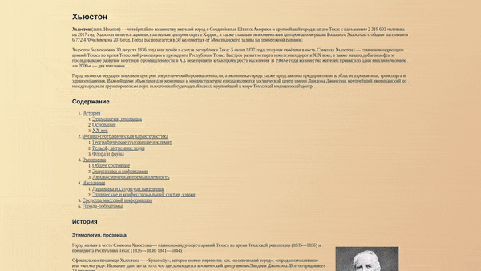

# Houston

### Use Skills

---

[Demo Link  ](https://golovanovalex.github.io/Houston_First_Site_HTML_CSS/)

## Info

Создано на основе задания с курса с сайта [Stepik](https://welcome.stepik.org/ru)

Верстка страницы сайта. Работа с **HTML**, **CSS**.  
Основная задача - обучение основным тегам в HTML, в частности со **списками** и **таблицами**.  
Работа с основными свойствами CSS.  
"Первый" сайт по заданию.

---

## Contacts

- <a href="mailto:golovanov.a.a@yandex.ru" >Golovanov.a.a@yandex.ru</a>

 Made with 💙
